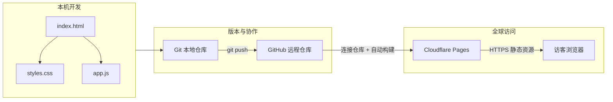
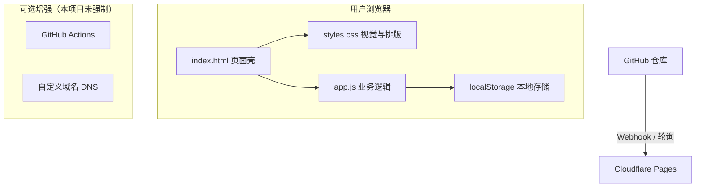

# AIRADAR 小项目全链路：从需求到上线网页（可对外分享版）

> 本文记录：**用 AI 协作完成一个纯静态「AI 协作力测评」网页**，并**部署到 GitHub + Cloudflare Pages**，形成可访问的公网地址的全过程。适合作为工作坊讲义、内部分享或复盘材料。

---

## 一、项目是什么（30 秒版）

**AIRADAR** 是一个运行在浏览器里的轻量测评页：用户完成多道量表题后，得到四轴分数、可视化报告卡与文字洞察。**不依赖后端数据库**，数据默认存在用户本机浏览器（`localStorage`），适合教学、直播破冰与个人复盘。

---

## 二、技术栈关系（简洁框图）

### 2.1 架构总览（开发 → 托管 → 访问）



**读图要点：**

| 层级 | 技术 | 作用 |
|------|------|------|
| 页面与逻辑 | HTML / CSS / JavaScript | 结构、样式、题目与计分逻辑，**无构建步骤** |
| 版本管理 | Git | 记录变更、分支、回滚 |
| 代码托管 | GitHub | 远程仓库、与 Cloudflare 对接的「单一事实来源」 |
| 静态托管与 CDN | Cloudflare Pages | 从 GitHub 拉代码、发布到全球边缘节点，生成 `*.pages.dev` 域名 |
| 访问侧 | 任意现代浏览器 | 只请求静态文件，无需安装 App |

### 2.2 技术栈「谁依赖谁」（更细一层）



**说明：** 本仓库是**纯静态站**，构建命令可为空；**不引入** Node/Webpack 也能完整运行。若日后加自动化测试或双平台部署，再在 `optional` 层扩展即可。

### 2.3 纯文本版关系（不依赖 Mermaid 渲染时可看）

```
[ 本机：index.html + styles.css + app.js ]
              |
              v
        [ Git 提交 / 推送 ]
              |
              v
[ GitHub 仓库 main 分支 ] ----连接----> [ Cloudflare Pages ]
                                              |
                                              v
                                    [ 访客 HTTPS 访问 *.pages.dev ]
```

---

## 三、与 Cursor 协作：我们实际怎么做（对话式开发）

> 文中「Cursor」指 **Cursor 编辑器里的 AI 协作**（你提到的与「咳嗽」同音的误写，这里统一为 Cursor）。

### 3.1 推荐协作节奏

1. **写清需求**：功能（测评维度、题量、结果页）、调性（例如高级橙、可截图分享）、约束（免费托管、尽量轻量）。
2. **让 AI 生成初版文件**：`index.html` / `styles.css` / `app.js`，先跑通主流程。
3. **本机验证**：用浏览器直接打开 `index.html`，或用本地静态服务（见下）避免部分浏览器对 `file://` 的限制。
4. **迭代指令要具体**：例如「结果区要分层排版」「报告卡适合截图」「部署到 Cloudflare」——越具体，改动越集中。
5. **由你执行敏感操作**：登录 GitHub、粘贴 Token、在 Cloudflare 控制台点授权——AI 无法代替你完成账号侧操作。

### 3.2 本地预览（可选）

在项目目录执行其一即可：

```bash
# Python 3
python3 -m http.server 8080
# 浏览器访问 http://127.0.0.1:8080
```

便于检查相对路径、`localStorage` 等行为是否与线上一致。

### 3.3 「自动化」部分（刻意写短）

- **本项目没有**配置复杂的 CI 脚本或 GitHub Actions：静态文件 **`git push` 后由 Cloudflare Pages 自动拉取并发布**，这就是最主要的「自动化」。
- 若将来要加：例如 **PR 预览环境**、**链接检查**、**压缩资源**，再单独加 workflow 文件即可，不属于本期必选项。

---

## 四、Git：初始化、关联 GitHub、推送代码

### 4.1 本地初始化（首次）

```bash
cd /你的项目路径/76-20260411-AI测试小程序
git init -b main
git add index.html styles.css app.js .gitignore
git commit -m "feat: AIRADAR 静态站初版"
```

### 4.2 在 GitHub 上建空仓库

1. 打开 [github.com/new](https://github.com/new) 创建仓库（示例：`MyAIAbilityWebTest`）。
2. **建议先不要**勾选自动添加 README（避免首次推送需先 `pull` 合并）。

### 4.3 关联远程并推送

**HTTPS（新手友好，用 Personal Access Token 当密码）：**

```bash
git remote add origin https://github.com/你的用户名/你的仓库名.git
git push -u origin main
```

**常见故障与处理：**

| 现象 | 原因 | 处理 |
|------|------|------|
| `403 Permission denied` | 仍在用账号密码，或本机缓存了旧 Token | 在 GitHub 生成 **Classic PAT**，勾选 `repo`；清除 macOS 钥匙串里 `github.com` 的旧凭据后重试 |
| `Connection closed`（SSH） | 网络/22 端口被干扰 | 改用 HTTPS+Token；或 SSH 走 443（`ssh.github.com`） |
| 远程已有 README 导致冲突 | 远程非空 | `git pull origin main --rebase` 后再 `git push` |

**清除 GitHub HTTPS 缓存（macOS 示例）：**

```bash
printf "host=github.com\nprotocol=https\n\n" | git credential-osxkeychain erase
```

---

## 五、Cloudflare Pages：从连接仓库到线上可访问

### 5.1 前置条件

- Cloudflare 账号（免费档即可）。
- GitHub 仓库已存在且 **`main` 分支已 push 成功**。

### 5.2 创建 Pages 项目（连接 Git）

1. 登录 [Cloudflare Dashboard](https://dash.cloudflare.com/)。
2. 进入 **Workers & Pages** → **Create** → **Pages** → **Connect to Git**。
3. 按提示 **授权 GitHub**，选择仓库（如 `MyAIAbilityWebTest`）与分支 **`main`**。

### 5.3 构建设置（静态站「关键设置点」）

本项目为**仓库根目录下的纯静态文件**，无打包：

| 配置项 | 建议值 | 说明 |
|--------|--------|------|
| Framework preset | **None** 或未使用框架模板 | 避免误判成 React/Vue 项目 |
| Build command | **留空** | 没有 `npm run build` |
| Build output directory | **`/`** 或 **`.`** | 输出目录即站点根，`index.html` 在根目录 |
| Root directory（根目录） | **留空** 或 `/` | 若代码不在子目录则不要填子路径 |

保存后触发第一次 **Deploy**。

### 5.4 部署结果与调试

- 成功后 Pages 会分配 **`https://<项目名>.pages.dev`**（具体以控制台为准）。
- **若白屏或 404：**
  - 看该次部署的 **Build log**：是否误执行了构建命令导致失败。
  - 核对 **Output directory**：必须指向包含 `index.html` 的目录。
  - 本地用 `python3 -m http.server` 对比路径是否一致。

### 5.5 自定义域名（可选）

在 Pages 项目 → **Custom domains** 添加你的域名，按提示在域名注册商处配置 **CNAME** 到 Cloudflare 指定目标；必要时完成 DNS 传播等待。

---

## 六、自动更新与后续优化（总体说明）

### 6.1 自动更新（你已具备的流程）

```text
本地改代码 → git commit → git push origin main
         → Cloudflare Pages 检测到新提交 → 自动重新构建与发布
```

无需每次登录 Cloudflare 手动上传；**主线就是「推代码即发布」**。

### 6.2 后续可优化方向（按需）

| 方向 | 说明 |
|------|------|
| 国内访问 | 海外 CDN 对大陆访问不稳定时可另部署镜像（如 Gitee Pages / 对象存储静态托管），双链分流 |
| 监控与回滚 | 在 Cloudflare 保留历史部署，一键回滚到上一版本 |
| 性能 | 静态资源可加缓存头、按需压缩图片；本项目体量小，优先级不高 |
| 隐私与合规 | 若未来接后端或统计，再补隐私说明与 Cookie 提示 |

---

## 七、全流程检查清单（对外分享时可附在文末）

- [ ] 三文件（或更多静态资源）在本地浏览器验证通过  
- [ ] `git remote -v` 指向正确 GitHub 仓库  
- [ ] `git push` 成功，`main` 在 GitHub 上可见  
- [ ] Cloudflare Pages 已连接该仓库，构建命令为空、输出目录正确  
- [ ] `*.pages.dev` 可打开且功能正常  
- [ ] （可选）自定义域名解析成功  

---

## 八、结语

这个小项目的本质是：**用最少依赖（HTML/CSS/JS）交付完整交互**，再用 **GitHub + Cloudflare Pages** 完成 **免费、可自动更新的公网托管**。与 Cursor 的协作价值在于：把需求拆成可执行的文件结构与迭代步骤；**部署与账号安全仍由你本人把关**——这也是团队里推广 AI 辅助开发时值得强调的一点。

---

*文档版本：与仓库 `AIRADAR` 静态站实践同步，可作对外发送的说明附件。*
